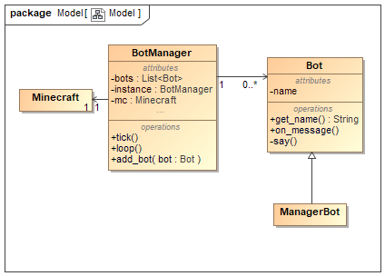
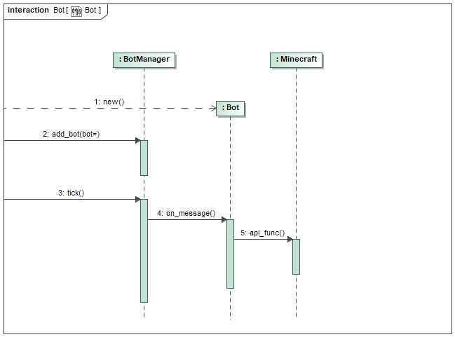

# Minecraft Agent Framework

Authors:

- Kristiyan Tonev
- Eric Riveiro

## Description

This is a framework for creating bots in Minecraft.
The bots respond to messages in the chat,
and can execute an action when they are mentioned.

## Architecture

The bots are managed by a BotManager class, which is a singleton.
This class handles the connection to the server and holds a list of bots.
Periodically, the manager checks the chat for any bot mentions
and executes any bots that are mentioned using inversion of control.
A bot is considered mentioned when a player types `@` followed by the name of the bot.

On mention, the BotManager invokes the Bot and passes it the message that triggered it.

## Creating bots

To create a bot, create a child class of the Bot class.
The Bot class expects a name of type `str` to be passed to the constructor.

To customize the bot action, you must override the `on_message()` method.
This method accepts `self`,
the instance of `mcpi.minecraft.Minecraft` currently connected to,
and the instance of `mcpi.event.ChatEvent` that triggered the bot.
The `ChatEvent` contains the `entityId` of the player that sent the message,
and `message` which is the text itself.
This way we can customize the action depending on the player and the message.

Because we receive the `Minecraft` object, we can use the full mcpi API in our bots.
Please do not use `Minecraft.event.pollChatPosts()`,
as this will cause the BotManager to miss chat events.

The Bot class has a special method `say()` which posts a message to chat
automatically prepending the name of the bot in angle brackets.

Check the example bots provided for more details.

### Contract of Bot class

| Method | Parameters | Returns | Description |
|--------|------------|---------|-------------|
|on_message|self: Bot, mc: mcpi.minecraft.Minecraft, msg: mcpi.event.ChatEvent| No return value | Function that is called when the bot is mentioned |
|get_name|None|str|The name of the bot, defined at instantiation time|

## Usage

To use the framework, first make sure the server is running.
Then create an instance of the `BotManager` class.
Instantiate and add bots to the manager using the `add_bot()` method.
Finally, use `BotManager.loop()` to run the manager on its own,
or `BotManager.tick()` to run the manager in your own custom loop.

To run the examples, first start the minecraft server, then run `run.sh`

## Examples

The following bot examples are available in this repository:
|Bot|Description|
|---|---|
|ManagerBot|Lists available bots|
|OracleBot|Magic 8 ball clone, responds to yes or no questions|
|EchoBot|Repeats what you said|
|BuilderBot|Builds you a wooden house|
|TrivialBot|Play a trivia game, if you dare...|
|toBohcE|dias uoy tahw staepeR|

## Diagrams

### Class diagram

### Sequence diagram

